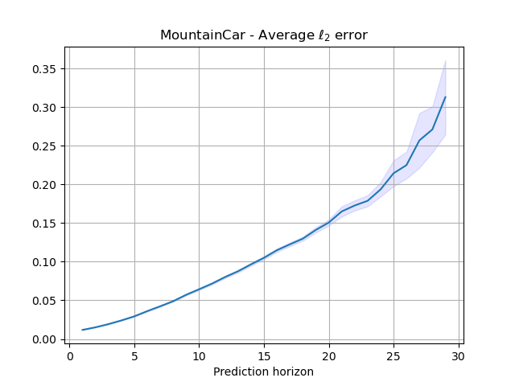

# Learnable Environments for Model-Based Reinforcement Learning

The goal of this repository is to provide a gym-compatible library to easily perform model-based Reinforcement Learning experiments using PyTorch.
The library makes it easier to create learnable environments and ensembles of networks that can be used to learn the dynamics of an environment.

Specifically, the library provides the following:

- Provide a gym-like interface for environments that use a neural network to model the transition/reward function
- Provide implementations of neural networks used to model the transition/reward function (leveraging ensembles of networks)

See also the example in `example/test.py` to see an example of ensemble network trained on the `CartPole` environment.

Author: Alessio Russo, alessior@kth.se

## Example

In the following example we create an ensemble of 5 networks to emulate the CartPole environment in OpenGym. Refer to the file in example/test.py for more details.

```python
import numpy as np
from learnable_environment import CartPoleLearnableEnvironment
from learnable_environment.ensemble_model import GaussianEnsemble, LayerInfo, GaussianEnsembleNetwork

# Ensemble size
n_models = 5

# State dimension, action dimension, reward dimension
state_dim = np.prod(CartPoleLearnableEnvironment.observation_space.shape)
action_dim = 1
reward_dim = 1

# Ensemble Network definition
layers = [
    LayerInfo(input_size = state_dim + action_dim, output_size = 120, weight_decay = 1e-3), 
    LayerInfo(input_size = 120, output_size = 40, weight_decay = 1e-3),
    LayerInfo(input_size = 40, output_size = state_dim + reward_dim, weight_decay = 5e-4)]
network = GaussianEnsembleNetwork(n_models, layers)

# Use ensemble network to create a model
model = GaussianEnsemble(network, lr=1e-2)

# Load ensemble or train it using maximum likelihood
# .....


# Test ensemble
envEnsemble = CartPoleLearnableEnvironment(model)
done = False
while not done:
    action = envEnsemble.action_space.sample()
    next_state, reward, done, info = envEnsemble.step(action)
    state =  next_state

```

## Example - Prediction error

In the following plot we see the performance of an ensemble of 5 networks used to learn the dynamics of the CartPole environment (CartPole-v0 in OpenGym). The network has been trained with 1000 samples, batch size of 64 elements and a learning rate of 0.01. The network has 1 hidden layer with `in_features=80` and `out_features=40`.

![Prediction error at different horizon lengths][(example-cartpole.png.png "Cartpole") 

## How to add new environments

Any new environment needs to implement 3 functions:

- `_termination_fn(state, action, next_state)`: termination function. Evaluates if the MDP has reached a terminal state
- `_reset_fn()`: reset function (returns the initial state)
- `_reward_fn(state, action, next_state, done)`: reward function (in case you don't want to use the one learnt by the ensemble)

Check the example in `learnable_environment/cartpole.py` for more details.

## How to add new ensembles or transition function models

To add a new type of model that represents a transition function/reward function, you need to create an `EnsembleModel` that implements the `predict(inputs)` function, where `inputs` is a numpy array that concatenates `(state, action)`. The function must return the next state, and possibly, the predicted reward. Check an example of implementation in `learnable_environment/ensemble_model/gaussian_ensemble_model.py`.

Integrate this model in the `LearnableEnvironment` class (in `learnable_environment/learnable_environment.py`) in the `_step` function (add a new `if isinstance(self.model, YourModelName)` with your code).

## Roadmap

- Add MujoCo environments
- Add MountainCarContinuous

### Implemented environments

- CartPole-v0
- MountainCar-v0

### Implemented ensembles

- Gaussian ensemble